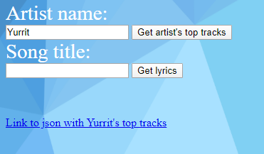
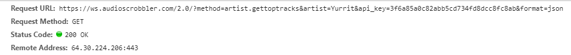
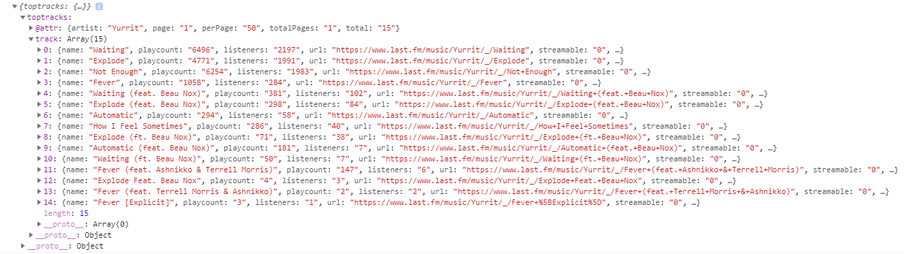
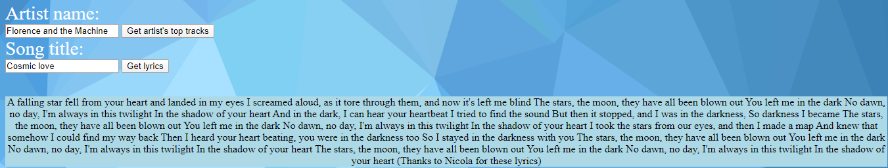
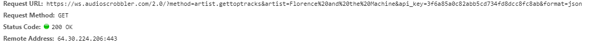
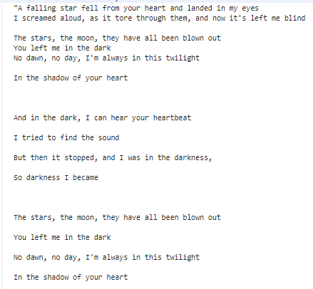

# Proiect Cloud

Simplă aplicație pentru iubitorii de muzică. Aplicația are două câmpuri de text în care se pot introduce valori
și două butoane.

## Descriere problema

O preferință personală de a mea este de a avea o modalitate de a vedea care sunt cele mai ascultate melodii ale unui
artist preferat. Această aplicație încearcă să facă acest lucru într-un mod rapid și simplu.

Aplicația are câmpuri de text în care se introduc numele artistului și titlul melodiei, precum și două butoane 
pentru a căuta cele mai populare melodii ale artistului respectiv și pentru a vedea versurile unei anumite piese.

## Prezentare API-uri utilizate

Pentru această aplicația am folosit un API de la provider-ul Last.fm pentru a vizualiza melodiile artiștilor și 
lyrics.ovh pentru versuri.

Dintre toate metodele API oferite de Last.fm, singura care a fost folosită a fost artist.getTopTracks care 
generează o listă de 50 de cântece în oridine descrescătoare, după popularitate.

## Descriere arhitectura

* Metode HTTP

Aplicația are două funcții cu metode de tip GET care aduc și afișează informații.

Aceasta este funcția care afișează un link către un JSON cu primele 50 melodii populare ale artistului
căutat:

```
async function getMusic() {
              let artist = document.getElementById('artist').value
              
              let url = `http://ws.audioscrobbler.com/2.0/?method=artist.gettoptracks&artist=${artist}&api_key=3f6a85a0c82abb5cd734fd8dcc8fc8ab&format=json`
              
              let response = await fetch(url)
              let data = await response.json()
              
              console.log(data)
              
              var a = document.createElement('a')
              var linkText = document.createTextNode(`Link to json with ${artist}'s top tracks`)
              a.appendChild(linkText)
              a.href = `http://ws.audioscrobbler.com/2.0/?method=artist.gettoptracks&artist=${artist}&api_key=3f6a85a0c82abb5cd734fd8dcc8fc8ab&format=json`
              document.body.appendChild(a)
          }
```
JSON-ul poate fi importat în Google Sheets.

A doua metodă GET este în a foua funcție și afișează versurile unei melodii:

```
async function getLyrics() {
              let artist = document.getElementById('artist').value
              let title = document.getElementById('title').value
              
              let url = `https://api.lyrics.ovh/v1/${artist}/${title}`
              
              let response = await fetch(url)
              let data = await response.json()
              
              console.log(data)
              
              document.getElementById('content').innerHTML = data.lyrics
          }
```
* Exemple de request/response:

Request pentru Lastfm: se introduce numele artistului și se apasă butonul de lângă câmpul de text, ceea ce va crea un link către JSON.




Response Lastfm:



Request lyrics.ovh:




Response lyrics.ovh:


